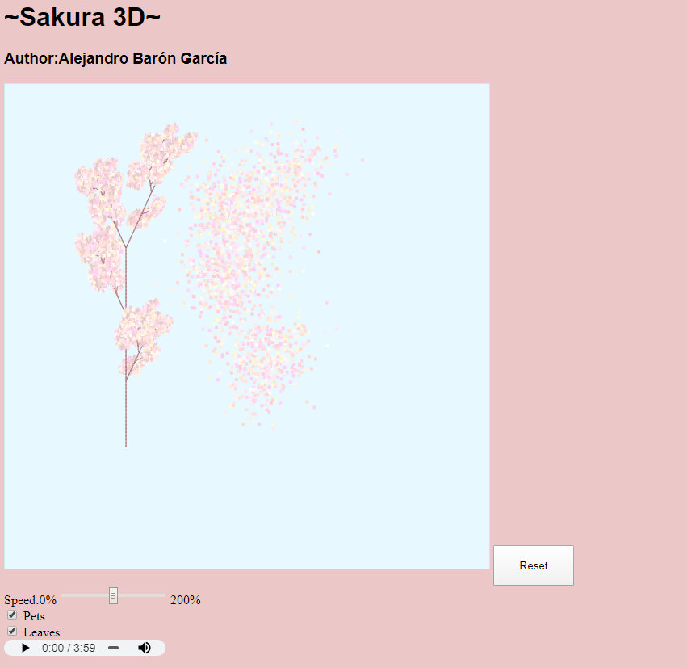

# Sakura-3d

WebGL Based 3D Sakura tree visualization, using GLMatrix. 

[Try it](https://alejandrobaron.github.io/sakura-3d/)

It's generated through [L-Systems](https://en.wikipedia.org/wiki/L-system) (Free Context Grammars based tree models) with a bit of randomness (each time you reset/refresh, it's a slightly different tree). Petals follow a particle system simulating wind 

Feel free to contact me for any enquires!

PS: Music included in the model

# sakura-3d
